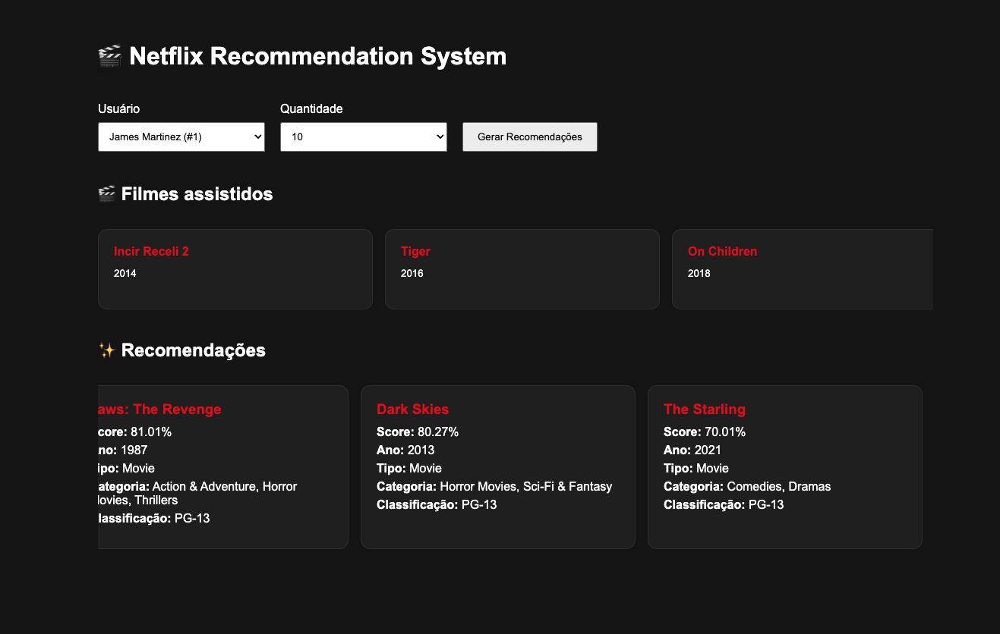

# 🎬 Netflix Recommendation System with TensorFlow.js

Sistema de recomendação de filmes desenvolvido em JavaScript utilizando TensorFlow.js como projeto da disciplina de Pós-graduação em Engenharia de Inteligência Artificial.

O objetivo é construir um mecanismo de recomendação baseado em aprendizado supervisionado, utilizando embeddings, rede neural e inferência em tempo real.

---

# Demonstração

O sistema permite:

- Carregar automaticamente os datasets
- Construir o contexto da aplicação
- Gerar embeddings de filmes e usuários
- Treinar uma rede neural utilizando TensorFlow.js
- Recomendar filmes personalizados para cada usuário
- Visualizar os filmes assistidos e as recomendações pela interface Web

---

# Tecnologias

- JavaScript (ES Modules)
- TensorFlow.js
- PapaParse
- HTML5
- CSS3
- Browser Sync

---

# Estrutura do Projeto

```
src
│
├── context
│   └── makeContext.js
│
├── services
│   ├── movieService.js
│   ├── userService.js
│   └── historyService.js
│
├── encoders
│   ├── movieEncoder.js
│   └── userEncoder.js
│
├── vectorizers
│   ├── movieVectorizer.js
│   └── userVectorizer.js
│
├── training
│   ├── createTrainingData.js
│   └── modelTraining.js
│
├── recommendation
│   └── recommendMovies.js
│
├── ui
│   ├── events.js
│   ├── renderRecommendations.js
│   ├── renderUsers.js
│   ├── renderWatchedMovies.js
│   └── status.js
│
├── utils
│   └── random.js
│
└── main.js
```

---

# Dataset

O projeto utiliza três conjuntos de dados.

## Filmes

Arquivo:

```
netflix_titles.csv
```

Informações utilizadas:

- título
- tipo
- ano
- classificação indicativa
- duração
- gêneros

---

## Usuários

Arquivo:

```
users.csv
```

Informações utilizadas:

- idade
- país
- assinatura
- horas assistidas
- gênero favorito

---

## Histórico

Arquivo

```
user_history.csv
```

Relaciona usuários aos filmes assistidos.

---

---

# Screenshots

## Tela Inicial



---

# Pipeline da Aplicação


O sistema segue o fluxo abaixo durante sua execução.


A execução ocorre em sete etapas principais:

1. Leitura dos datasets
2. Construção do contexto da aplicação
3. Geração dos embeddings
4. Criação do conjunto de treinamento
5. Treinamento da rede neural
6. Inferência utilizando o modelo treinado
7. Exibição das recomendações
---

# Contexto da Aplicação

Durante a inicialização é criado um contexto contendo estruturas auxiliares para acelerar consultas.

## Filmes

- moviesById
- movieVectors
- movieVectorsById

## Usuários

- usersById
- usersWithHistory
- usersWithHistoryById
- userVectors
- userVectorsById

## Histórico

- historyByUser
- historyByMovie

## Índices

Também são construídos índices para codificação categórica.

Exemplos:

- genresIndex
- ratingsIndex
- subscriptionsIndex
- favoriteGenresIndex

Além dos valores mínimos e máximos utilizados na normalização.

---

# Encoding

## Filmes

Cada filme é convertido para um vetor composto por:

- Ano (normalizado)
- Duração (normalizada)
- Tipo (One-Hot)
- Classificação (One-Hot)
- Gêneros (Multi-Hot)

---

## Usuários

Cada usuário é representado por:

- Idade (normalizada)
- Horas assistidas (normalizadas)
- Assinatura (One-Hot)
- Gênero favorito (One-Hot)
- Média dos vetores dos filmes já assistidos

---

# Treinamento

O treinamento utiliza aprendizado supervisionado.

Para cada usuário são gerados:

- exemplos positivos (filmes assistidos)
- exemplos negativos (filmes não assistidos)

Cada entrada da rede neural é formada por:

```
User Vector

+

Movie Vector
```

A saída da rede representa a probabilidade daquele usuário gostar do filme.

---

# Arquitetura da Rede Neural

```
Entrada

↓

Dense (128)

↓

Dense (64)

↓

Dense (32)

↓

Dense (1)

↓

Sigmoid
```

Configuração:

- Optimizer: Adam
- Loss: Binary Crossentropy
- Métrica: Accuracy

---

# Sistema de Recomendação

Após o treinamento:

1. Seleciona o usuário
2. Remove os filmes já assistidos
3. Gera os vetores dos candidatos
4. Executa `model.predict()`
5. Obtém o score de cada filme
6. Ordena por probabilidade
7. Exibe as recomendações

---

# Interface

A aplicação Web permite:

- seleção do usuário
- visualização dos filmes assistidos
- geração das recomendações
- exibição do score calculado pela rede neural

---

# Problema Encontrado

A estratégia apresentada originalmente em aula gerava um exemplo para cada combinação possível entre usuário e filme.

Considerando aproximadamente:

- 25.000 usuários
- 8.800 filmes

o algoritmo produzia cerca de:

```
220 milhões de exemplos
```

Esse volume consumia mais de **100 GB de memória**, tornando inviável a execução no navegador.

Como solução, foi implementada uma estratégia baseada em **Negative Sampling**, gerando apenas:

- exemplos positivos
- uma quantidade equivalente de exemplos negativos aleatórios

Essa abordagem reduziu drasticamente o consumo de memória, mantendo o treinamento viável.

---

# Teste GitHub Pages

---

# Próximas Etapas

- [x] Leitura dos datasets
- [x] Construção do contexto
- [x] Encoding dos filmes
- [x] Encoding dos usuários
- [x] Geração dos vetores
- [x] Treinamento da rede neural
- [x] Sistema de recomendação
- [x] Interface Web
- [ ] Persistência dos vetores
- [ ] Persistência do modelo treinado
- [ ] Busca vetorial em banco de dados
- [ ] Recomendação em tempo real